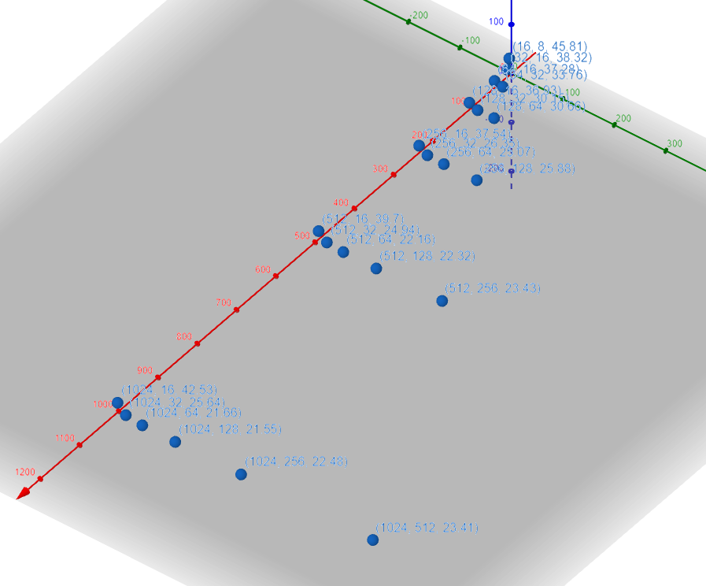
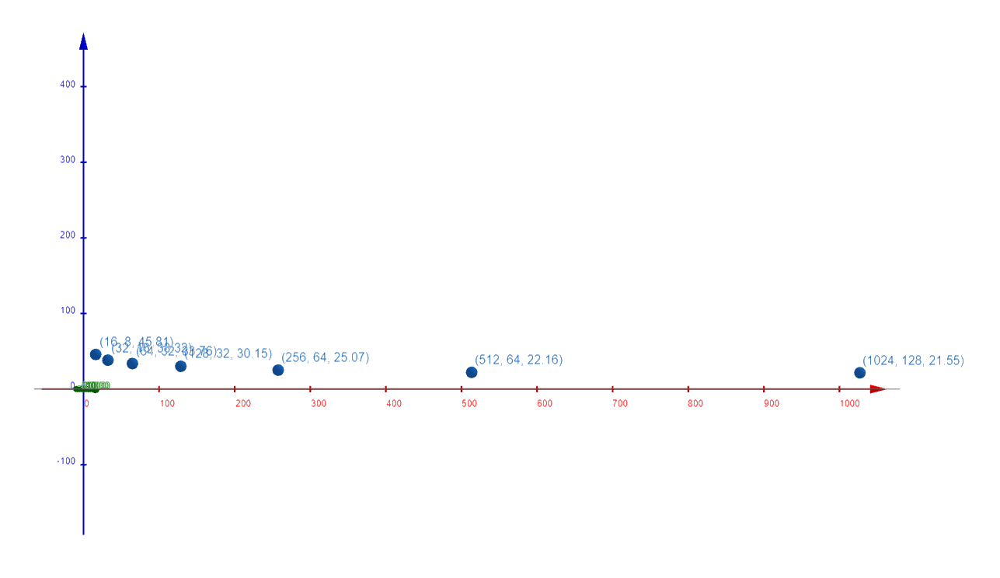
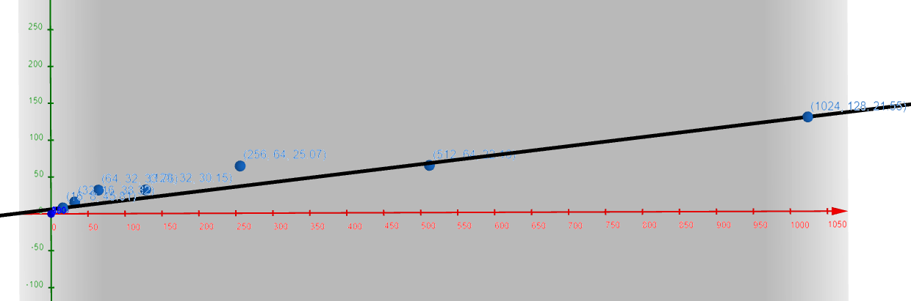

# TM-LZ77
Miembros del grupo:
    - Richard Sudario Berrocal
    - Nil Viñals Nin

Para modificar los valores de ventana de entrada y ventana deslizante se ha de modificar el fichero data.txt
Siguiendo este formato:
Ment,#
Mdes,#

1. Aplicad vuestro compresor LZ77 a los datos contenidos en la imagen BMP que teneis disponible en Campus Virtual. Se trata de una imagen de pequeñas dimensiones y 256 colores. Consejo: Extraed las componentes R,G,B de cada píxel, vectorizádlas (pasad de matriz 2D a vector 1D) y concatenádlas (primero vector de R, despues vector de G y finalmente, vector B). Convertid esta secuencia de enteros de 8 bits a un string binario.

Demostrado en el codigo.

2. Ajustad los tamaños de las ventanas de comporesión entre los valors habituales para lograr compresión. ¿Qué conclusiones sacais?

Los valores que valen la pena para hacer la comprension dentro del rango 0 -> 1024 son estos:

De donde podemos extraer los mejores resultados: 

Estas graficas se basan en: ( MDES, MENT, numero de bits en miles ).

Donde podemos ver que se puede trazar una linea más o menos de los mejores resultados. Al hacerse mayor la distancia en desde el punto 0,0 siguiendo la línea, mejor resultado de compresión da.
Por ejemplo, el mejor resultado (1024, 128) nos da un comprensión ratio de 2.2395712495939866, mientras unos de los mejores resultados más cercanos al 0,0, (128,32) nos da uno de 1.6007230034491908.